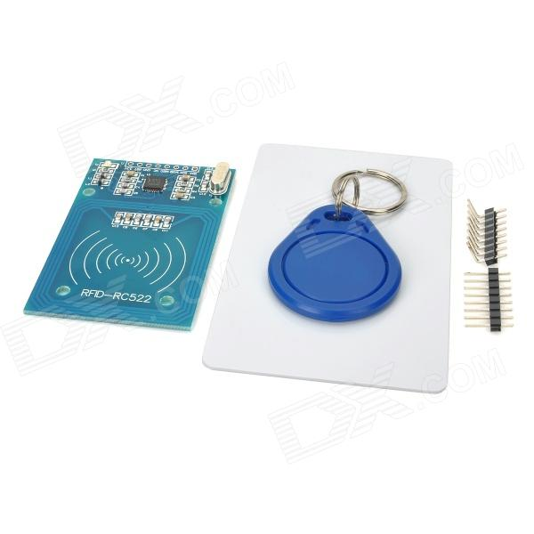
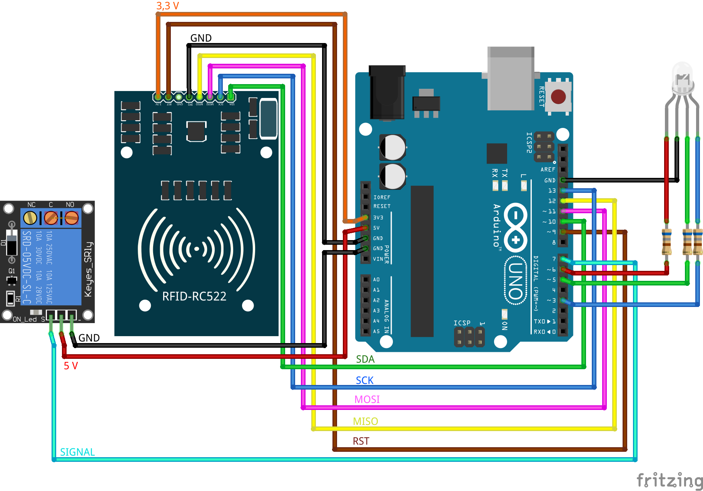
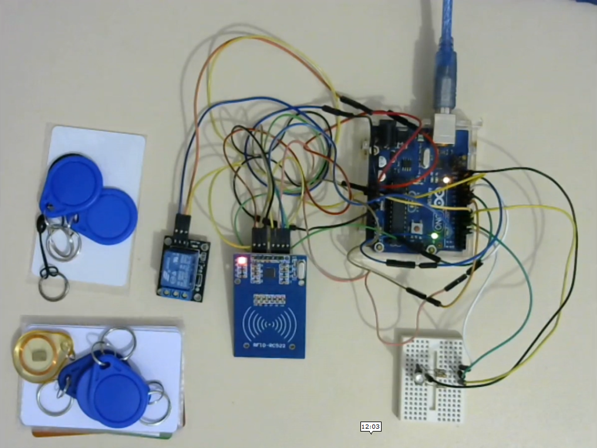

# Arduino Uno + MFRC522 (Módulo RFID de 13,56 MHz) para controle de acesso

### Módulo

O módulo é 

### Projeto 

Este projeto é baseado na biblioteca MFRC522 de André Balboa (miguelbalboa) disponível em https://github.com/miguelbalboa/rfid

### Protótipo

Este protótipo foi criado para exibir o funcionamento de um controle de segurança de acesso por tag/cartão de 13,56 MHz.

### Funcionamento

O funcionamento pode ser visto em [https://www.youtube.com/watch?v=N7hWXzj6Gnw](https://www.youtube.com/watch?v=N7hWXzj6Gnw)