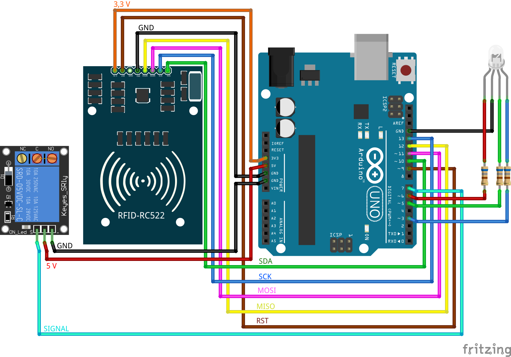

# Arduino Uno + MFRC522 (Módulo RFID de 13,56 MHz) para controle de acesso
### Projeto 

Este projeto/protótipo é baseado na biblioteca MFRC522 de André Balboa (miguelbalboa) disponível em https://github.com/miguelbalboa/rfid

