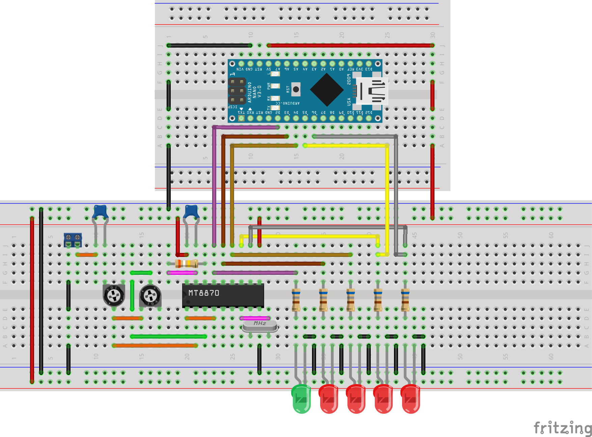

# Arduino Nano + MT8870D (Integrated DTMF Receiver) para controle de acesso a distância por telefone

### Circuito integrado MT8870D

O circuito integrado MT8870D é disponibilizado em um invólucro PDIP com 18 pinos conforme imagem

Conforme o datasheet "(datasheet) MT8870D or MT8870D-1 Integrated DTMF Receiver (MITEL)(1997).pdf" duas aplicações usuais são:
*Sistema de cartões de crédito;
*Controle remoto por telefone;
*Usuários respondendo máquinas por telefone.

Um exemplo de controle por telefone era o jogo Hugo no qual pode ser visto seu funcionamento no seguinte link [Hugo: O 1º Game da TV brasileira!](https://youtu.be/TRc8IhhRAfw?t=102)

### Projeto 

O projeto é visto a seguir nas visualizações em protoboard e no esquemático

### Protótipo

Este protótipo foi criado para exibir o funcionamento de dados enviados por uma ligação entre celulares.

### Funcionamento

O funcionamento pode ser visto em [https://youtu.be/0JnZYzo0gNk](https://youtu.be/0JnZYzo0gNk)
